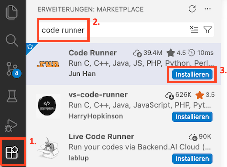
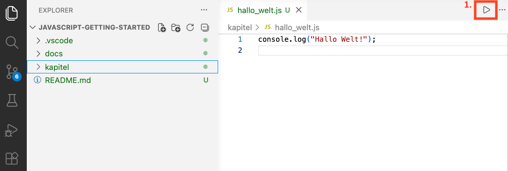

# JavaScript Grundlagen - Getting Started

Dieses Repository ist die Basis für die Kurse auf https://www.codesurfer.io/schulungen.
Folge dieser Anleitung, um deine JavaScript-Umgebung einzurichten:

### Voraussetzungen

1. **Visual Studio Code installieren**
   - Lade Visual Studio Code [**hier herunterladen**](https://code.visualstudio.com/download) und installiere es auf deinem System

2. **Node.js installieren**
   - Benötigt: Node.js Version 20 oder neuer
   - Lade Node.js [**hier herunterladen**](https://nodejs.org/en/download) oder nutze NVM: `nvm install 20`

3. **Code Runner Extension installieren**
   - Öffne Visual Studio Code
   - Gehe zu Extensions
   - Suche nach **„Code Runner"** und installiere die Extension

   

### Projekt Setup

4. **Dateien herunterladen**
   - Lade das Projekt [**hier herunterladen**](https://github.com/nils-hoyer/testautomation-getting-started/archive/refs/heads/main.zip) oder nutze Git: `git clone https://github.com/nils-hoyer/testautomation-getting-started.git`

5. **Projekt in Visual Studio Code öffnen**
   - Öffne Visual Studio Code
   - Datei > Ordner öffnen... und wähle den heruntergeladenen Ordner

### Setup testen

6. **Erste Datei ausführen**
   - Öffne die Datei `Kapitel/hallo_welt.js`
   - Klicke rechts oben auf den **▶ Play-Button**.

   

Wenn du `Hallo Welt!` im Terminal siehst, bist du startklar für das Seminar!

Happy Testing! 🚀